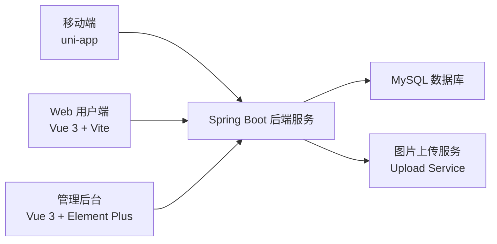
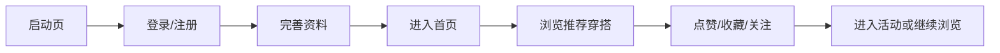

# 青搭毕业设计说明书第 3 章框架草案

说明：本文件用于承接 `06-graduation-design-draft-ch1-ch2.md`，对应毕业设计说明书第 3 章“系统整体结构设计”。写法上参考了徐文特毕业设计中“整体结构设计 + 主要流程设计 + 数据库设计”的组织方式，但已结合青搭现有代码与开题报告内容进行了本项目化改写。

## 3.1 参考框架转译

徐文特的毕业设计框架可以概括为“首页资讯 + 社区发布 + 商城 + 我的 + 后台支撑”。青搭在业务上与其结构相近，但场景从“冷门宠物”切换为“校园穿搭内容平台”，因此可将其转译为以下对应关系：

| 参考毕业设计模块 | 青搭对应模块 | 当前工程落点 |
| --- | --- | --- |
| 首页资讯 | 首页穿搭内容流、公告、活动入口 | `mobile-uniapp/pages/index/`、`web/src/views/HomeView.vue` |
| 生活广场/社区 | 内容详情、点赞评论收藏、关注作者 | `pages/detail/`、`pages/comments/`、`web/src/views/PostDetailView.vue` |
| 发布动态 | 穿搭发布、草稿箱、活动绑定、商品链接 | `pages/publish/`、`pages/drafts/`、`web/src/views/PublishView.vue` |
| 商城 | 商品导购跳转、商家合作、创作者激励 | `pages/product-jump/`、`pages/cooperations/`、`pages/incentives/` |
| 更多（我的） | 个人中心、设置、消息、资料编辑 | `pages/profile/`、`pages/settings/`、`pages/messages/` |
| 后台管理 | 内容审核、活动管理、商家管理、结算与提现 | `admin-web/src/views/` + `backend-java/modules/admin` |

因此，青搭并不是简单照搬参考项目，而是在保留其“前台功能分区 + 后台支撑”的写法基础上，扩展出更贴合开题报告的“内容、活动、激励、治理”四层结构。

## 3.2 系统总体架构设计

青搭采用前后端分离的总体架构，将用户访问层、业务服务层与数据存储层进行拆分。用户可以通过 Web 用户端或 uni-app 移动端访问系统，平台运营人员通过管理后台对内容、活动、商家与结算流程进行管理，所有端侧统一访问 Spring Boot 后端接口，业务数据最终存储于 MySQL 数据库中。

从工程目录看，系统整体结构可以对应为：

- 表现层
  - `mobile-uniapp/`
  - `web/`
  - `admin-web/`
- 业务接口层
  - `backend-java/src/main/java/com/campusfit/modules/`
- 数据层
  - `backend-java/src/main/resources/schema.sql`
  - `backend-java/src/main/resources/data.sql`
  - `database/`

这一结构具有较好的可维护性与扩展性。用户端与后台可并行开发，后端负责统一业务逻辑、权限控制和数据聚合，后续若要增加推荐策略、审核规则或活动玩法，也能在现有架构下平滑扩展。

## 3.3 系统主要流程设计

### 3.3.1 新用户冷启动流程

新用户首次进入系统时，先经过启动页与登录注册流程，再逐步进入首页浏览推荐内容。若用户进一步完善资料并完成首次互动，如点赞、收藏、关注作者或参与活动，则可以加深对平台内容形态和价值的理解，形成稳定留存。

### 3.3.2 内容浏览与互动流程

用户可以从首页、搜索页、活动页等入口进入内容流，再点击卡片查看详情。进入详情页后，可执行点赞、评论、收藏、关注作者及商品跳转等操作。该流程构成平台最核心的内容消费主线，是提升内容热度与社区活跃度的基础。

业务链路可概括为：

`首页/搜索/活动 -> 内容卡片 -> 详情页 -> 点赞/评论/收藏 -> 关注作者/导购跳转`

### 3.3.3 内容发布与审核流程

创作者在发布页上传图片、填写文案、选择场景和风格标签，并可按需要绑定活动或商家合作单。内容提交后进入待审核状态，经后台审核通过后正式上线；若审核驳回，则可重新编辑并再次提交。

业务链路可概括为：

`进入发布页 -> 上传图片 -> 填写标题与文案 -> 选择标签/活动/合作单 -> 保存草稿或提交 -> 后台审核 -> 审核通过后展示`

### 3.3.4 活动、激励与后台治理流程

平台通过活动中心将内容生产与运营玩法绑定，创作者可选择活动参与投稿。内容审核通过后进入活动统计池，后续再与创作者激励、合作单奖励和提现审核形成闭环。后台则负责活动配置、商家合作、内容审核、公告发布和结算审核等运营动作。

业务链路可概括为：

`活动配置 -> 用户参与活动投稿 -> 内容审核 -> 数据统计 -> 激励结算 -> 提现申请 -> 后台审核`

## 3.4 功能模块结构设计

### 3.4.1 用户端功能结构

用户端功能结构可以按四层理解：

- 账号与身份层
  - 启动页
  - 登录注册
  - 资料完善
- 内容消费层
  - 首页内容流
  - 搜索与标签筛选
  - 内容详情
  - 点赞、评论、收藏、关注
- 内容生产层
  - 发布页
  - 草稿箱
  - 活动绑定
  - 商品链接绑定
- 个人中心层
  - 我的发布
  - 我的收藏
  - 关注与粉丝
  - 消息通知
  - 设置与资料编辑
  - 创作者激励
  - 我的合作

从当前代码看，移动端已具备较完整的页面骨架，主要页面包括：

- `pages/index`
- `pages/publish`
- `pages/search`
- `pages/detail`
- `pages/profile`
- `pages/messages`
- `pages/incentives`
- `pages/cooperations`
- `pages/drafts`

Web 用户端则以同样的业务结构补充了桌面端访问与演示能力。

### 3.4.2 管理后台功能结构

管理后台主要承担平台治理与运营支撑作用，可分为以下模块：

- 数据看板
  - 总览平台内容、用户、活动和结算数据
- 内容审核
  - 审核帖子内容与查看详情
- 活动管理
  - 创建、编辑、上下架活动
- 公告管理
  - 维护官方公告
- 商家与合作管理
  - 商家信息维护
  - 创作者合作单管理
- 资金与结算管理
  - 激励结算
  - 提现审核
- 用户管理
  - 用户状态与资料管理

对应到当前工程，后台页面主要位于 `admin-web/src/views/`，核心页面包括：

- `DashboardView.vue`
- `ContentAuditView.vue`
- `ActivityManageView.vue`
- `AnnouncementManageView.vue`
- `MerchantManageView.vue`
- `CooperationManageView.vue`
- `SettlementView.vue`
- `WithdrawRequestView.vue`
- `UserManageView.vue`

### 3.4.3 后端模块结构

青搭后端以模块化方式组织业务逻辑，主要包括：

- `auth`
  - 用户注册、登录、验证码与会话
- `post`
  - 内容流、详情、评论、点赞、收藏、导购跳转
- `profile`
  - 个人资料、关注关系、激励中心、提现申请
- `activity`
  - 活动列表、活动详情、活动绑定
- `message`
  - 消息通知
- `announcement`
  - 公告能力
- `cooperation`
  - 创作者合作单
- `draft`
  - 草稿箱
- `tag`
  - 标签选项
- `upload`
  - 图片上传
- `admin`
  - 后台管理接口

这种结构既便于在论文中按“模块实现”展开描述，也有助于后续持续开发。

## 3.5 数据库设计

青搭数据库围绕“用户、内容、互动、活动、激励、治理”六类核心对象展开。数据库设计既要支撑用户端的内容浏览与互动，也要支持后台的审核、活动管理、商家合作和提现审核。

### 3.5.1 用户与资料类核心表

- `app_user`
  - 存储用户账号基础信息
- `user_profile`
  - 存储学校、年级、签名、头像、封面等扩展资料
- `user_follow`
  - 存储用户关注关系

### 3.5.2 内容与互动类核心表

- `post`
  - 穿搭内容主表
- `post_image`
  - 帖子图片
- `post_tag`
  - 内容标签
- `product_link`
  - 商品链接
- `product_link_click`
  - 导购点击记录
- `post_like`
  - 点赞关系
- `post_favorite`
  - 收藏关系
- `post_comment`
  - 评论信息
- `post_comment_like`
  - 评论点赞
- `post_draft`
  - 草稿箱

### 3.5.3 运营与增长类核心表

- `activity_topic`
  - 活动主题
- `user_activity_join`
  - 用户参与活动记录
- `post_activity_binding`
  - 内容与活动绑定关系
- `official_announcement`
  - 官方公告
- `message_notification`
  - 消息通知
- `creator_cooperation`
  - 创作者合作单
- `merchant`
  - 商家信息
- `commission_record`
  - 激励与结算记录
- `creator_withdraw_request`
  - 提现申请

### 3.5.4 治理与后台类核心表

- `report_record`
  - 举报记录
- `sys_admin_user`
  - 管理员账号

若在论文中展开，可重点选择 `app_user`、`user_profile`、`post`、`post_image`、`activity_topic`、`post_draft`、`creator_cooperation`、`creator_withdraw_request` 等表做详细说明，并辅以主键、外键与业务含义解释。

## 3.6 工程结构与论文章节映射

为了让论文写作与代码实现能够一一对应，建议按以下方式引用代码材料：

| 论文章节 | 代码与文档素材 |
| --- | --- |
| 第 2 章 系统需求分析 | `01-product-strategy-and-prd.md`、`03-product-flows-architecture-and-rules.md` |
| 第 3 章 系统整体结构设计 | 当前文件、`schema.sql`、`pages.json`、`web/src/router/index.js` |
| 第 4 章 系统开发与实现 | `web/`、`mobile-uniapp/`、`admin-web/`、`backend-java/modules/` |
| 第 4 章 管理后台实现 | `admin-web/src/views/`、`backend-java/modules/admin/` |
| 第 4 章 数据库与接口实现 | `backend-java/src/main/resources/schema.sql`、各模块 controller/service |

## 3.7 本章写作建议

如果你后续直接把这份框架整理进毕业设计正文，可以用下面的表达逻辑：

1. 先说明系统采用前后端分离架构，包含用户端、管理后台、后端和数据库四层。
2. 再说明系统围绕“内容浏览、内容发布、活动运营、平台治理”四条主线展开。
3. 接着把用户端、后台端、后端模块和数据库表分别落到实际工程目录。
4. 最后通过 1 到 2 张总体架构图和流程图，把第 3 章收束成一个完整的“系统框架”章节。

这样写出来的第 3 章，会比单纯列页面清单更像一篇完整的毕业设计说明书，也更贴近你参考的徐文特毕业设计结构。
